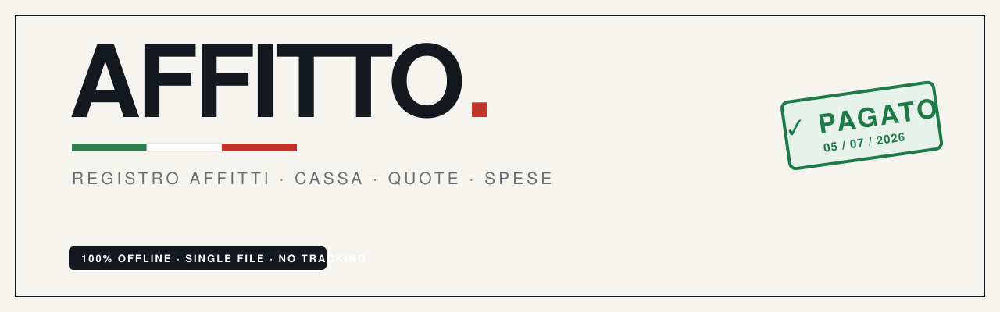

# AFFITTO

Registro affitti mensile, cassa comune e ripartizione spese per case condivise — in un **singolo file HTML**, senza dipendenze, senza backend, senza tracciamento. Tutti i dati vivono nel browser (`localStorage`), con export/import JSON e CSV per il backup.

<p align="center">
  <a href="https://lorenzdm93.github.io/affitto/](https://lorenzdm93.github.io/Affitto-App-di-Contabilita-per-Affitti/"><strong>▶ Run it in your browser</strong></a>
</p>

---

## Cosa fa 

- **Panoramica** — la pagina iniziale: saldo delle due casse, chi è in regola / chi deve pagare questo mese, e un riquadro **"Da pagare"** che elenca ogni voce scoperta (anche i mesi precedenti in carry-over) con la data di scadenza e i **giorni di ritardo a oggi**, ordinati dal più arretrato. In fondo, ultimo prelievo e totale prelevato per persona.
- **Registro** — la checklist mensile. Ogni voce si timbra come pagata con un timbro "✓ Pagato" datato. Navigazione mese per mese, barra di avanzamento, evidenza dei ritardi.
- **Spese** — spese comuni (IMU, assicurazione, manutenzioni…) a carico dei proprietari, con pagamento **dalla cassa conto, dalla cassa contanti o da conti esterni**.
- **Cassa** — fondo comune diviso in **cassa conto** e **cassa contanti**: entrate dai pagamenti, prelievi per persona e spese pagate dal fondo, con saldi separati e movimenti in ordine cronologico.
- **Grafici** — pagato vs. dovuto per mese, totali annuali e per persona, dettaglio mensile.
- **Gestione** — voci e persone: importi, chi condivide ciascuna voce, e per ogni voce frequenza, scadenza, parte in contanti e **ripartizione personalizzata**.

## Dettagli utili

- **Persone e quote** — assegni ogni voce alle persone che la dividono. La ripartizione è a **parti uguali** di default, oppure a **percentuale del totale** o a **importo fisso** per persona, con verifica che le quote tornino.
- **Frequenza e scadenza** — ogni voce può essere mensile, bimestrale, trimestrale, semestrale o annuale, con giorno di scadenza per il calcolo dei ritardi.
- **Pagamenti anticipati** — puoi timbrare in anticipo i mesi futuri di una voce: quando il mese arriva, risulta già pagato.
- **Mesi passati congelati** — ogni mese passato conserva una copia della sua configurazione: modificare voci o importi oggi **non altera** i mesi già trascorsi. Le azioni sul mese (replica setup, aggiorna, svuota) sono sempre esplicite.
- **Mesi esclusi** — un mese senza affitti (es. prima dell'inizio) può essere escluso dai conteggi: vale zero nel dovuto annuale, nei grafici, nelle quote e negli arretrati. Reversibile in un click.
- **Saldi iniziali** — imposti quanto c'è già in cassa conto e in cassa contanti, così parti dal valore reale senza ricostruire lo storico.

## Uso

1. Apri l'app (il link della demo, oppure `index.html` in locale).
2. In **Gestione** aggiungi le persone e le voci di spesa; assegna chi condivide cosa.
3. Ogni mese, in **Registro**, timbra i pagamenti man mano che arrivano.
4. Registra prelievi e spese comuni nelle rispettive schede.
5. Esporta un backup JSON ogni tanto (in **Gestione → Backup dei dati**).

> I dati sono salvati **solo in questo browser**. Svuotare la cache o cambiare dispositivo li cancella: usa l'export JSON per non perderli. Il CSV serve invece per analisi in Excel / Google Sheets.

## Deploy su GitHub Pages

1. Crea un repository (es. `affitto`) e caricaci `index.html`, `README.md` e `banner.png`.
2. **Settings → Pages → Branch: `main` / root → Save.**
3. Dopo un minuto l'app è online su `https://<tuo-username>.github.io/affitto/`.

## Uso locale

Nessuna build: scarica `index.html` e aprilo con doppio click. Funziona completamente offline.

## Multi-utente con Firebase (opzionale)

L'app è predisposta per la sincronizzazione tra più utenti senza modifiche alla UI. Espone un'API globale `window.AFFITTO`:

```js
// push locale -> remoto (a ogni modifica)
AFFITTO.onChange(s => setDoc(doc(db, "case", casaId), s));

// remoto -> locale (quando arriva uno snapshot)
onSnapshot(doc(db, "case", casaId), snap => {
  const remote = snap.data();
  if (remote && remote.updatedAt !== AFFITTO.getState().updatedAt) {
    AFFITTO.applyRemote(remote);   // last-write-wins su updatedAt
  }
});
```

Ogni stato ha un `updatedAt` e uno `schemaVersion`; la funzione interna `migrate()` normalizza qualsiasi dato in ingresso (locale, import o remoto). Per l'uso reale (timbri sporadici) il last-write-wins sull'intero documento è adeguato; per editing fortemente concorrente conviene passare a documenti Firestore separati per mese.

## Tecnologia

HTML, CSS e JavaScript vanilla in un unico file. Nessun framework, nessuna dipendenza esterna, nessuna chiamata di rete. Design ispirato al modernismo di Massimo Vignelli.

## Licenza

MIT — usalo e modificalo liberamente.
